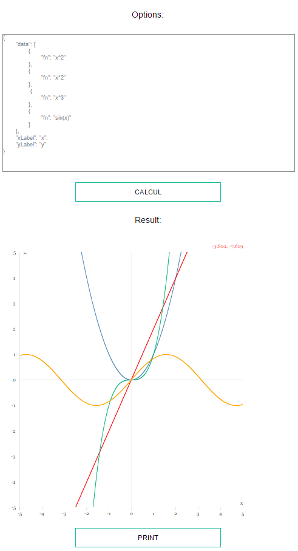

# Grafa

A application to display functions

[](http://cedced19.github.io/grafa/)

This application use [function-plot](http://maurizzzio.github.io/function-plot/).

To compile:
```bash
$ npm install
$ npm install -g gulp
$ gulp
```

See `gulpfile.js` for task config.


